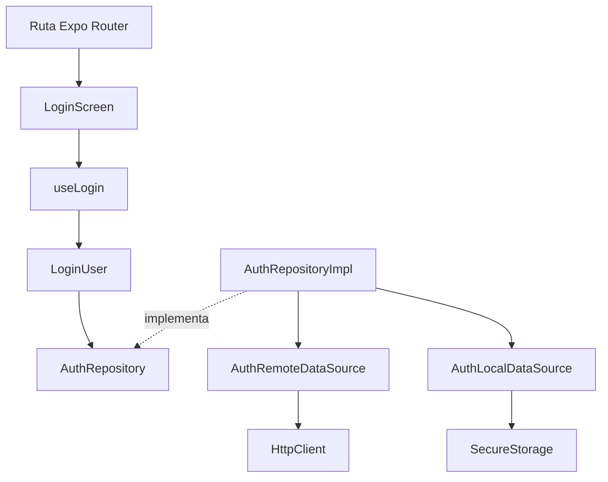

# Arquitectura

## Decisiones principales

**Expo** reduce la configuración nativa inicial, ofrece versiones coordinadas de
React Native y módulos, y permite Continuous Native Generation sin mantener
`android/` e `ios/` desde el primer día.

**Expo Router** coloca las rutas en `app/` y utiliza navegación basada en archivos.
Los archivos de ruta solo montan pantallas, proveedores o guardas de sesión; la lógica
de negocio permanece fuera de la navegación.

El plugin declara `root: "app"` de forma explícita. Expo Router prioriza normalmente
una carpeta `src/app`, pero en esta arquitectura ese nombre contiene configuración y
DI, no rutas. La opción evita la ambigüedad sin renombrar la estructura solicitada.

**Organización por funcionalidad** mantiene juntos dominio, datos y presentación de
una capacidad. Evita que carpetas técnicas globales crezcan sin contexto de negocio.

**Clean Architecture ligera** conserva las fronteras que aportan sustitución y
pruebas, sin crear una interfaz o clase para cada función trivial. `domain` es puro,
`data` contiene mecanismos sustituibles y `presentation` adapta casos de uso a React.

**Hooks controladores** como `useLogin` cumplen la coordinación que un ViewModel
realizaría en MVVM: administran carga/error, ejecutan casos de uso y actualizan sesión.
Encajan con el modelo funcional de React y evitan clases ViewModel artificiales.

**DI manual** mantiene el grafo tipado y visible, sin reflexión, decoradores ni estado
global mutable. `src/app/di/createDependencies.ts` es el Composition Root: es el único
lugar donde se construyen implementaciones concretas.

TanStack Query no se añadió porque la referencia solo tiene una sesión y tres
operaciones coordinadas por casos de uso; no existe todavía un conjunto de consultas
remotas compartidas que justifique caché, revalidación o deduplicación. Puede añadirse
cuando una funcionalidad tenga ese requisito. Redux o Zustand tampoco aportan valor
al alcance actual: Context solo mantiene sesión y entrega dependencias.

## Flujo de una acción

1. `app/(auth)/login.tsx` renderiza `LoginScreen`.
2. `LoginForm` valida con React Hook Form y Zod.
3. `useLogin` obtiene `LoginUser` mediante `useDependencies`.
4. `LoginUser` depende únicamente de `AuthRepository`.
5. El Composition Root construye la implementación real con configuración validada.
6. El repositorio coordina Data Sources, mapea el DTO y persiste la sesión.
7. `SessionProvider` guarda el usuario autenticado y la ruta protegida se habilita.

## Dirección de dependencias

| Capa           | Puede importar                                           | No puede importar                                                       |
| -------------- | -------------------------------------------------------- | ----------------------------------------------------------------------- |
| `domain`       | TypeScript y archivos de su propio dominio               | React, React Native, Expo, HTTP, almacenamiento, `data`, `presentation` |
| `data`         | `domain`, contratos de `shared/http` y `shared/storage`  | Pantallas, hooks o rutas                                                |
| `presentation` | Casos de uso, entidades, componentes compartidos y React | Implementaciones concretas, `fetch`, SecureStore                        |
| `app/di`       | Todas las capas necesarias para componer el grafo        | Reglas de interfaz o negocio                                            |
| `app/`         | Pantallas, providers, sesión y navegación                | Repositorios, Data Sources, HTTP                                        |

ESLint aplica `no-restricted-imports` específicamente sobre `domain` y prohíbe los
imports externos o de capas internas que romperían esta dirección.

## SOLID verificable

| Principio | Archivo                                                                                              | Aplicación                                                                                                     | Beneficio                                                |
| --------- | ---------------------------------------------------------------------------------------------------- | -------------------------------------------------------------------------------------------------------------- | -------------------------------------------------------- |
| SRP       | `LoginScreen.tsx`, `useLogin.ts`, `LoginUser.ts`, `AuthRepositoryImpl.ts`, `AuthRemoteDataSource.ts` | Cada archivo renderiza, coordina presentación, ejecuta negocio, orquesta datos o conoce HTTP, respectivamente. | Cambios de UI, negocio e infraestructura no se mezclan.  |
| OCP       | `createDependencies.ts`                                                                              | Conecta contratos e implementaciones sin modificar casos de uso o pantallas.                                   | Se agregan implementaciones sin reescribir consumidores. |
| LSP       | `AuthRepository.ts`, `AuthRepositoryImpl.ts`                                                         | La implementación respeta `login`, `logout` y `getCurrentSession`, incluidos persistencia y errores.           | Los dobles de prueba sustituyen al repositorio real.     |
| ISP       | `HttpClient.ts`, `SecureStorage.ts`, `AuthRepository.ts`                                             | Contratos pequeños y específicos; no existe un repositorio o servicio universal.                               | Fakes sencillos y consumidores con dependencias mínimas. |
| DIP       | `LoginUser.ts`, `LogoutUser.ts`, `GetCurrentUser.ts`                                                 | Los casos de uso reciben `AuthRepository`, nunca `fetch`, Expo SecureStore ni clases concretas.                | Dominio aislado, portable y probado sin React Native.    |

## Estado

- **Local de UI:** React Hook Form y `useState` en hooks/pantallas.
- **Remoto:** encapsulado por casos de uso, repositorio y Data Source.
- **Global de sesión:** `SessionProvider`; no es un contenedor de DI.
- **Infraestructura:** objetos inmutables entregados por `DependenciesProvider`.

Los dos Context tienen responsabilidades distintas: uno entrega el grafo de objetos;
el otro representa el estado observable de la sesión.

## Límites y validación

`FetchHttpClient` encapsula URL, JSON, headers, timeout, cancelación y códigos HTTP.
Su única aserción genérica ocurre en el límite de transporte, porque TypeScript no
puede validar `T` en ejecución. Los Data Sources siempre solicitan `unknown` y aplican
type guards antes de permitir que una respuesta entre al repositorio o al dominio.

`AuthLocalDataSource` valida el JSON recuperado de SecureStore. DTO y entidad son
estructuralmente parecidos, pero representan límites distintos: el DTO puede cambiar
con el backend; la entidad es el contrato estable que consumen los casos de uso.

## Decisiones contra la sobreingeniería

- No hay biblioteca de DI ni decoradores.
- No hay ViewModels de clase, Redux, Zustand o un bus de eventos.
- No hay interfaz para componentes o helpers puros.
- No hay una capa `services/` genérica.
- Los dobles de prueba se inyectan únicamente desde las pruebas, nunca en el runtime normal.
- El tema contiene solo tokens usados actualmente.
- No se generaron proyectos nativos.

## Sustituir implementaciones

El Composition Root crea `FetchHttpClient`, conectividad, ambos Data Sources y
`AuthRepositoryImpl`. `LoginUser`,
`useLogin` y `LoginScreen` permanecen sin cambios.

Para sustituir HTTP o almacenamiento en pruebas, implementa los contratos pequeños y
constrúyelos en un `Dependencies` de prueba. `DependenciesProvider` acepta ese grafo
explícitamente, sin modificar variables globales.

## Crear una funcionalidad futura

1. Define entidad, contrato de repositorio y casos de uso en su `domain`.
2. Modela el contrato externo con DTO y type guards en `data`.
3. Implementa Data Sources, mapper y repositorio.
4. Crea un hook controlador y pantallas en `presentation`.
5. Registra casos de uso en `Dependencies` y `createDependencies`.
6. Agrega rutas delgadas en `app/`.
7. Prueba cada frontera con fakes inyectados.

`shared/` solo debe recibir una pieza cuando dos o más funcionalidades la reutilicen o
cuando represente infraestructura transversal real, como HTTP, almacenamiento, errores
o tokens visuales.
